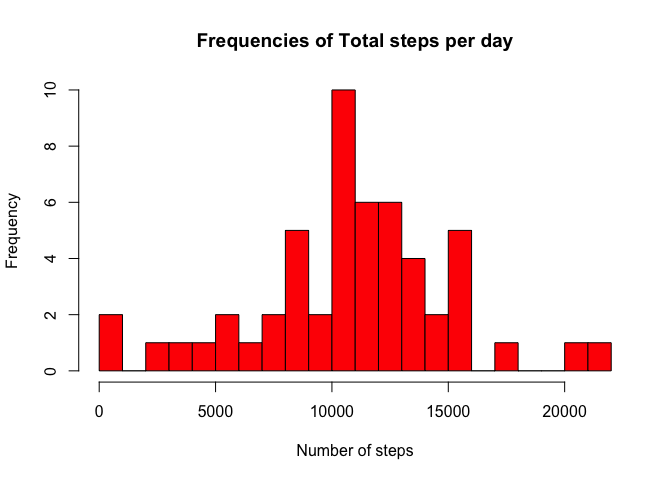
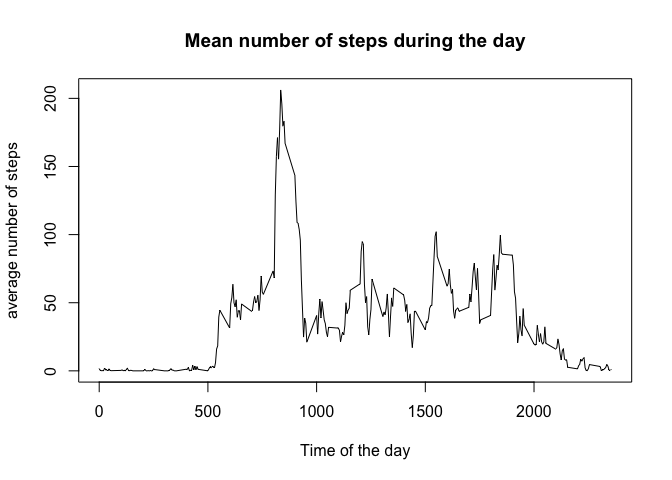
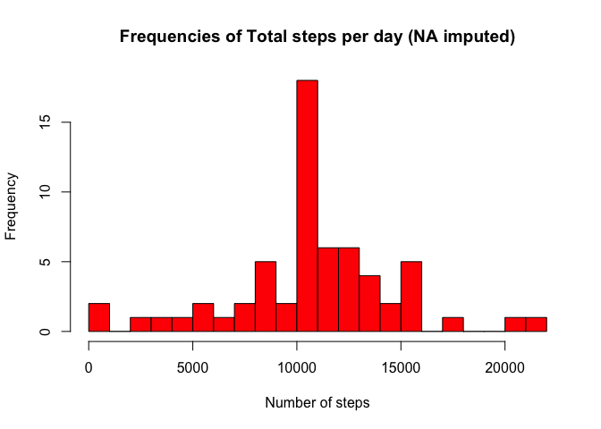
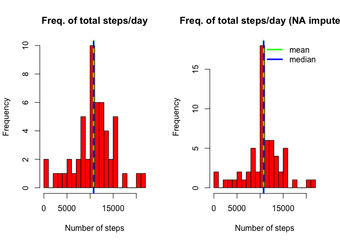
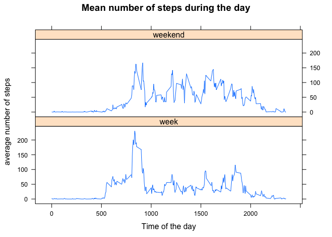

# Reproducible Research: Peer Assessment 1
Chris Flink (Nolost Intelligence)  


## Loading and preprocessing the data

First we check if the file is already unzipped, if not we extract the zip first.
Then we can read the csv file


```r
# Unzip file
if (!file.exists("activity.csv")) {
  unzip("activity.zip")
}

# Read file
df <- read.csv("activity.csv")

# Convert date strings to date type
df$date <- as.Date(df$date)

# Show dimensions of data frame
dim(df)
```

```
## [1] 17568     3
```

```r
# Show Summary of data frame
summary(df)
```

```
##      steps             date               interval     
##  Min.   :  0.00   Min.   :2012-10-01   Min.   :   0.0  
##  1st Qu.:  0.00   1st Qu.:2012-10-16   1st Qu.: 588.8  
##  Median :  0.00   Median :2012-10-31   Median :1177.5  
##  Mean   : 37.38   Mean   :2012-10-31   Mean   :1177.5  
##  3rd Qu.: 12.00   3rd Qu.:2012-11-15   3rd Qu.:1766.2  
##  Max.   :806.00   Max.   :2012-11-30   Max.   :2355.0  
##  NA's   :2304
```


## What is mean total number of steps taken per day?


```r
# Aggregate data, sum of steps per day
df.day <- aggregate(.~date, data=df, sum)

# Remove meaningless sum of interval
df.day <- df.day[,1:2]

# Display histogram
hist(df.day$steps, breaks=20, col="red", main="Frequencies of Total steps per day", xlab="Number of steps")
```



```r
# Display summary 
summary(df.day)
```

```
##       date                steps      
##  Min.   :2012-10-02   Min.   :   41  
##  1st Qu.:2012-10-16   1st Qu.: 8841  
##  Median :2012-10-29   Median :10765  
##  Mean   :2012-10-30   Mean   :10766  
##  3rd Qu.:2012-11-16   3rd Qu.:13294  
##  Max.   :2012-11-29   Max.   :21194
```

```r
mean(df.day$steps, na.rm = TRUE)
```

```
## [1] 10766.19
```

```r
median(df.day$steps, na.rm = TRUE)
```

```
## [1] 10765
```

So we see that the mean is 10766 steps per day and the median is 10765 steps per day (on 2012-10-29).

## What is the average daily activity pattern?


```r
# Aggregate data, sum of steps per interval
df.interval <- aggregate(.~interval, data=df, mean)

# Remove meaningless sum of interval
df.interval <- df.interval[,1:2]

# Show activity pattern in time series plot
plot(df.interval$interval, df.interval$steps, type="l", main="Mean number of steps during the day", xlab="Time of the day", ylab="average number of steps")
```



```r
# See interval with maximum number of steps (on average)
df.interval[which.max(df.interval$steps),]
```

```
##     interval    steps
## 104      835 206.1698
```

So on average 8:35 is the most active time of the day.

## Imputing missing values


```r
# Calculate number of missing values
number.missing <- sum(is.na(df$steps))

# So the number of missings is:
number.missing
```

```
## [1] 2304
```

```r
# What percentage of the dataset is this?
number.missing / nrow(df) * 100
```

```
## [1] 13.11475
```

```r
# So about 13% of the data is missing.

# We decide to impue the missing values by using the average of the number of steps
# for that specific interval.
df.impute <- transform(df, steps=ifelse(is.na(steps), df.interval$steps, steps))

summary(df.impute)
```

```
##      steps             date               interval     
##  Min.   :  0.00   Min.   :2012-10-01   Min.   :   0.0  
##  1st Qu.:  0.00   1st Qu.:2012-10-16   1st Qu.: 588.8  
##  Median :  0.00   Median :2012-10-31   Median :1177.5  
##  Mean   : 37.38   Mean   :2012-10-31   Mean   :1177.5  
##  3rd Qu.: 27.00   3rd Qu.:2012-11-15   3rd Qu.:1766.2  
##  Max.   :806.00   Max.   :2012-11-30   Max.   :2355.0
```

```r
# Recalculate sum of steps per day
df.day2 <- aggregate(.~date, data=df.impute, sum)

# Remove meaningless sum of interval
df.day2 <- df.day2[,1:2]

# Display histogram
hist(df.day2$steps, breaks=20, col="red", main="Frequencies of Total steps per day (NA imputed)", xlab="Number of steps")
```



```r
# Display summary 
summary(df.day2)
```

```
##       date                steps      
##  Min.   :2012-10-01   Min.   :   41  
##  1st Qu.:2012-10-16   1st Qu.: 9819  
##  Median :2012-10-31   Median :10766  
##  Mean   :2012-10-31   Mean   :10766  
##  3rd Qu.:2012-11-15   3rd Qu.:12811  
##  Max.   :2012-11-30   Max.   :21194
```

```r
# Calculate mean and median.
mean(df.day2$steps, na.rm = TRUE)
```

```
## [1] 10766.19
```

```r
median(df.day2$steps, na.rm = TRUE)
```

```
## [1] 10766.19
```

```r
# Let's look at the two plots side by side.
par(mfrow=c(1,2))
hist(df.day$steps, breaks=20, col="red", main="Freq. of total steps/day", xlab="Number of steps")
abline(v=mean(df.day$steps, na.rm = TRUE), col="green", lwd=3)
abline(v=median(df.day$steps, na.rm = TRUE), col="blue", lwd=3, lty=2)

hist(df.day2$steps, breaks=20, col="red", main="Freq. of total steps/day (NA imputed)", xlab="Number of steps")
abline(v=mean(df.day2$steps, na.rm = TRUE), col="green", lwd=3)
abline(v=median(df.day2$steps, na.rm = TRUE), col="blue", lwd=3, lty=2)
legend(x="topright", legend=c("mean","median"), col=c("green","blue"), bty="n", lwd=3)
```



The result of imputing the missing values is that the mean and median are the same
and the number of steps per day is more centered.


## Are there differences in activity patterns between weekdays and weekends?


```r
require(lubridate)
```

```
## Loading required package: lubridate
```

```r
# add column to dataset
df.impute$day <- ifelse((wday(df.impute$date) %in% c(1,7)),'weekend', 'week')

# Convert to factor
df.impute$day <- as.factor(df.impute$day)

# Aggregate data, sum of steps per interval and day
df.impute.interval <- aggregate(.~interval + day, data=df.impute, mean)

# Plot daily activity patterns using lattice
require(lattice)
```

```
## Loading required package: lattice
```

```r
xyplot(steps ~ interval | day, data = df.impute.interval, layout = c(1, 2), type="l", xlab = "Time of the day", ylab = "average number of steps", main="Mean number of steps during the day")
```



We see that the acitivity starts later and is more spread out through the day in the weekends.
